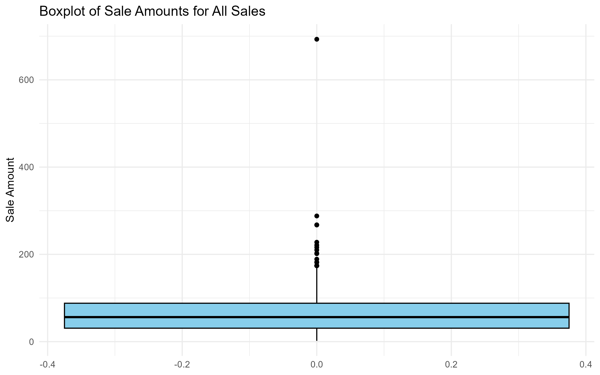
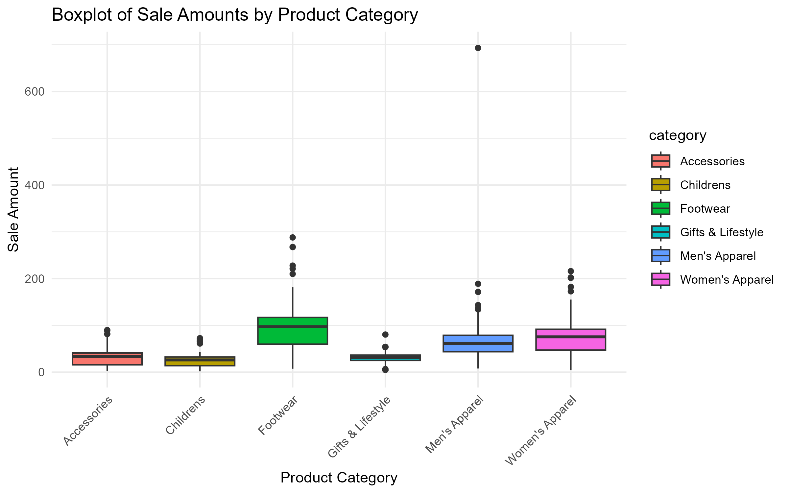
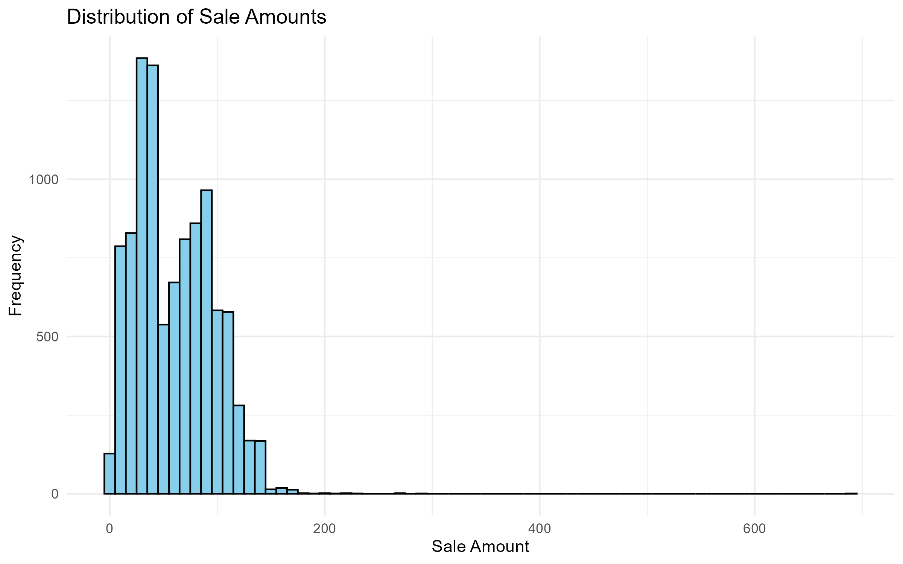
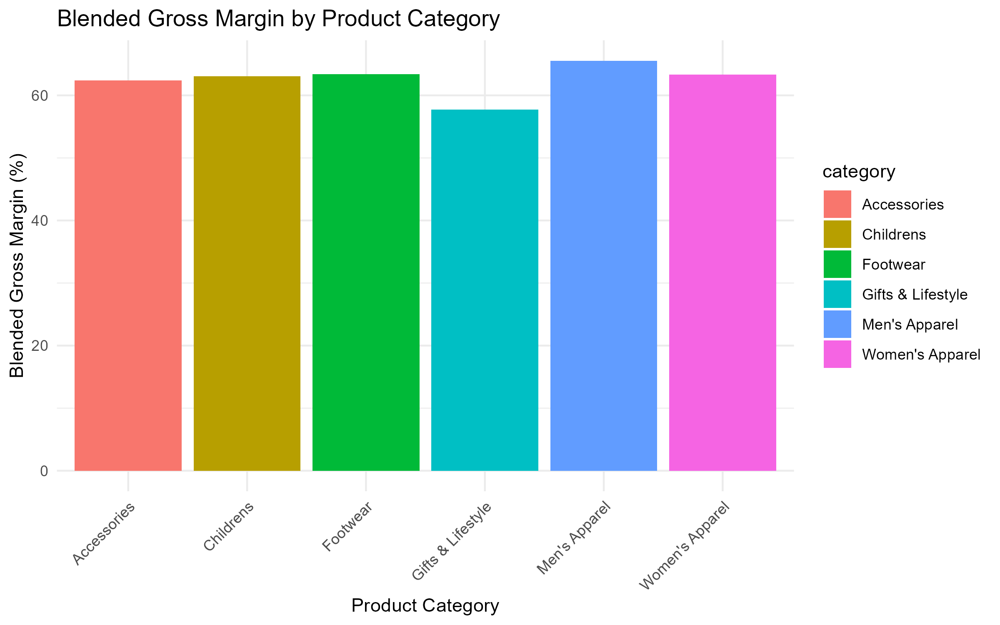
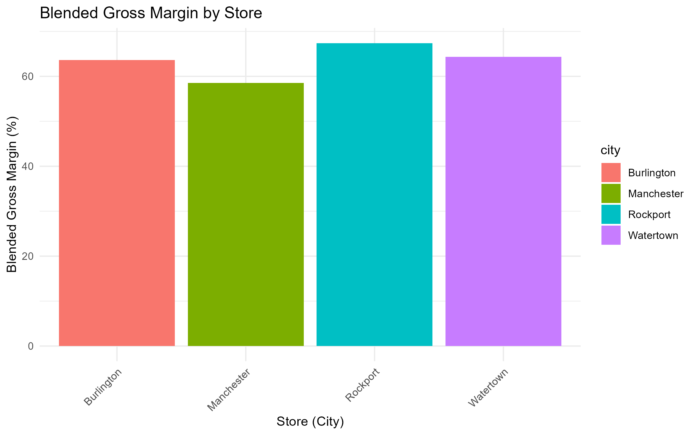
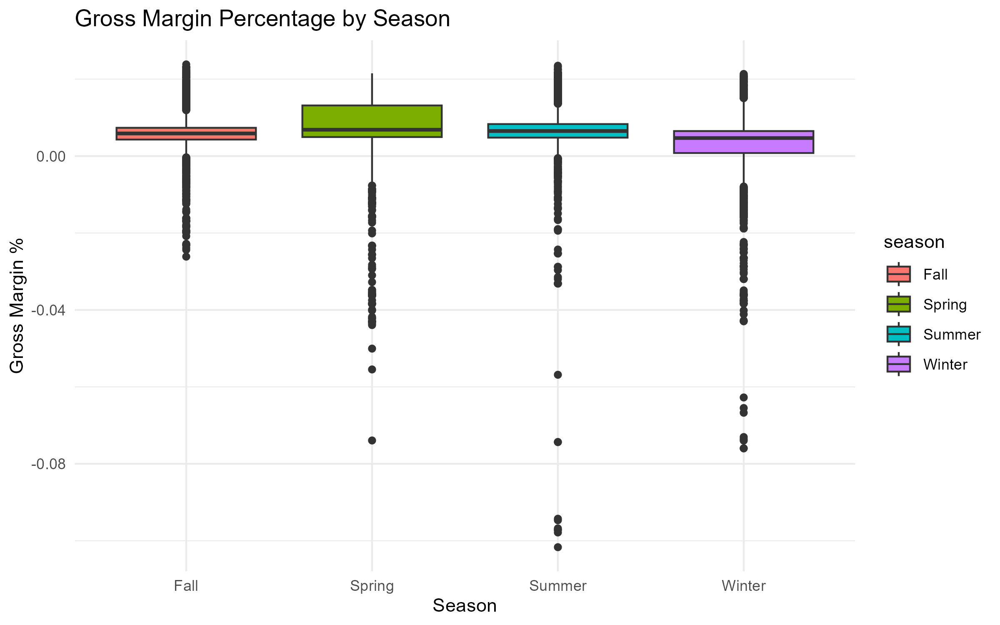
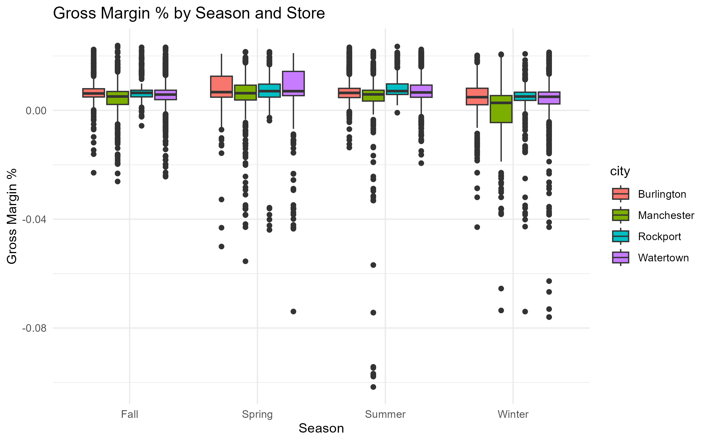
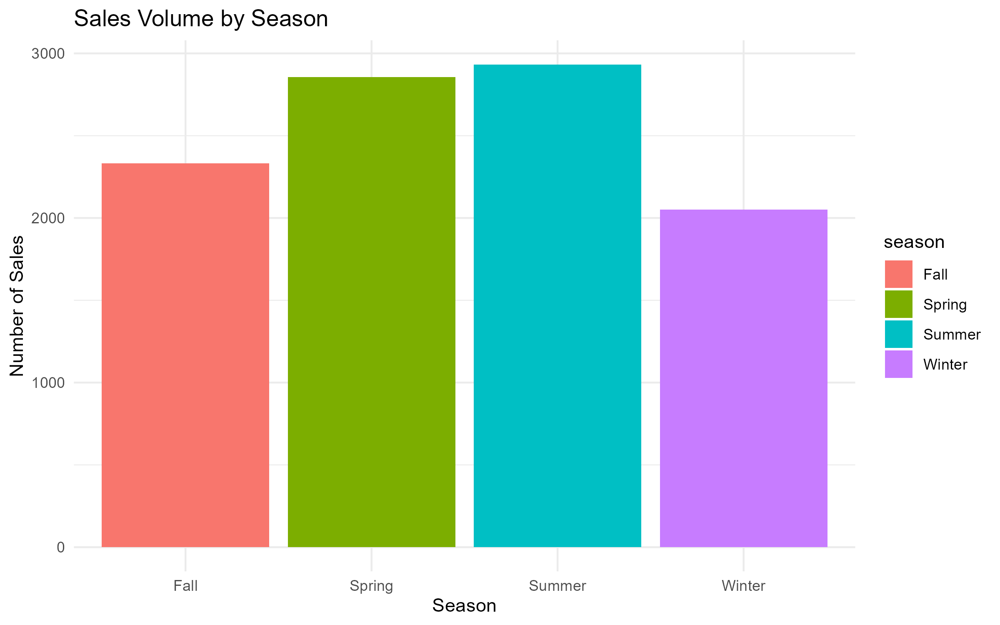
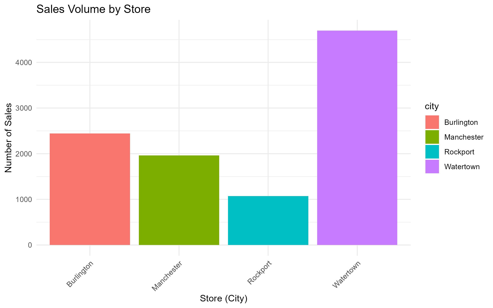
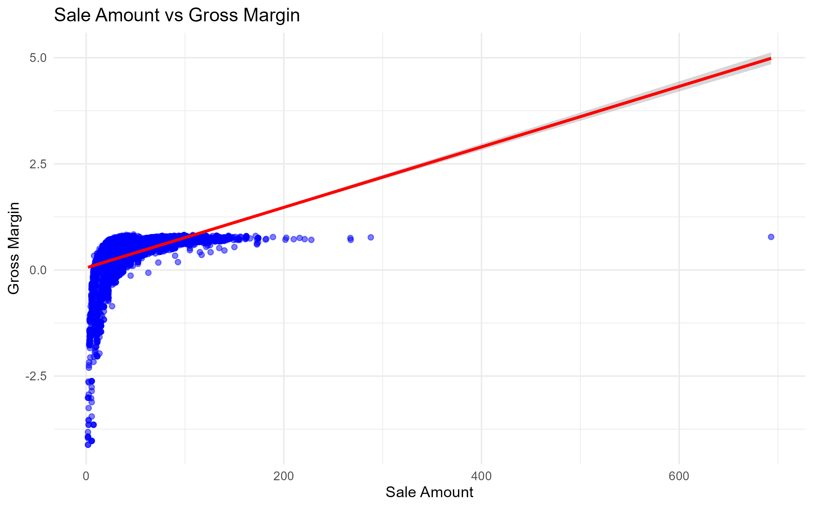

## Profitability and Customer Satisfaction Analysis – Boston Metro Area
Driving Retail Profitability Through Customer, Sales, and Store Data Analysis in the Boston Metro Area

*A comprehensive data analytics project exploring customer purchasing patterns, seasonal sales trends, and store-level performance across a multi-store apparel retailer.*
This analysis integrates statistical modeling, regression analysis, and visual storytelling to uncover actionable insights that improve profitability and business strategy.
---
## Project Overview
This project analyzes customer, sales, and store data for a U.S. retailer specializing in apparel and accessories, focusing on four store locations in the Boston metro area. The analysis was conducted to understand purchasing patterns, profitability trends, seasonal impacts, and key drivers of gross margins, with the goal of providing actionable business recommendations.

## Key Objectives
- Clean and integrate customer, sales, and store datasets.
- Analyze purchasing behavior, profitability trends, and seasonal impacts.
- Build a regression model to identify key drivers of gross margins.
- Provide business recommendations to improve financial performance.

## Files in This Repository

- `Code_File.R` – Final R script containing the complete data cleaning, analysis, visualizations, and store integration.
- `Analytics_Project_Summary.pdf` – Final project report including the ERD, methodology, detailed results, and business insights.

### Data (Raw Files)
- `Data/sales.xlsx` – Raw sales data.
- `Data/customers.xlsx` – Raw customer data.
- `Data/stores.csv` – Raw store-level data.

### Outputs (Result Files)
- `Outputs/customer_purchases.xlsx` – Cleaned and aggregated customer-level dataset.
- `Outputs/gross_margin_by_category.csv` – Blended gross margin by product category.
- `Outputs/gross_margin_by_store.csv` – Blended gross margin by store.
- `Outputs/model_summary.xlsx` – Regression model summary and coefficients.

### Visuals (Generated Charts)
- `/Visuals/` – Folder containing all project-generated visualizations, including:
  - Sale amount distributions
  - Gross margin by product category, store, and season
  - Sales volume by season and store
  - Sale amount vs. gross margin scatter plot

## Key Visualizations

### Sale Amount Distributions
**Boxplot of All Sales**  

**Sale Amount by Product Category**  

**Histogram of Sale Amount Distribution**  

### Gross Margin Analysis
**Blended Gross Margin by Product Category**  

**Blended Gross Margin by Store**  

**Gross Margin by Season**  

**Gross Margin by Season and Store**  

### Sales Volume Trends
**Sales Volume by Season**  

**Sales Volume by Store**  

### Sale Amount vs. Gross Margin
**Sale Amount vs. Gross Margin Scatter Plot**  

## Key Results

### Sale Amount Summary Statistics
- **Mean Sale Amount:** 60.60
- **Median Sale Amount:** 56.20
- **Standard Deviation:** 36.26
- **Skewness:** 1.01

### Outlier Detection
- 25 outliers identified using boxplot and z-score methods.
- Outliers were excluded from the analysis as they were likely data entry errors.

### Key Statistical Finding
- Gross margin percentage (GM%) varies significantly across seasons, as confirmed by ANOVA testing.
- Seasonal strategy adjustments are necessary to optimize profitability.

### Regression Model Summary
- **Model Performance:** R-squared = 72.75% (strong explanatory power)
- **Key Drivers of Gross Margin:**
  - Sale amount has a positive impact.
  - External costs reduce gross margins.
  - Full price and markdown pricing improve margins compared to clearance sales.
  - Women's apparel and footwear tend to have lower margins.

## Business Recommendations
1. **Seasonal Strategy Alignment:** Adjust inventory and promotions to target high-margin seasons.
2. **Category-Specific Pricing:** Improve pricing and cost control for low-margin categories.
3. **Dynamic Pricing:** Use markdowns strategically to drive sales without eroding margins.
4. **Loyalty Program Optimization:** Encourage loyalty members to purchase higher-margin products.

## Tools and Technologies
- R (dplyr, ggplot2, moments, readxl, writexl)
- Data cleaning, statistical testing, and visualizations
- Excel (file processing and final outputs)

## Acknowledgments
This project was completed as part of an academic analytics assignment focused on applying descriptive and inferential analytics to real-world business problems.
